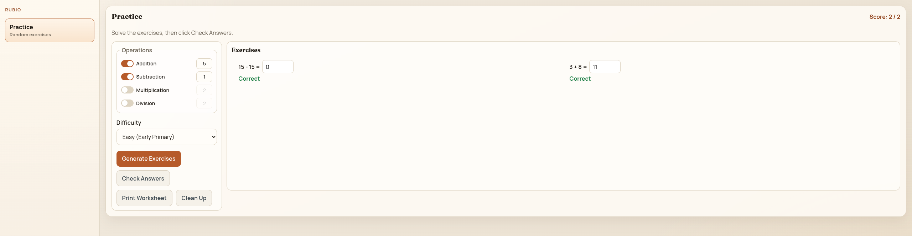
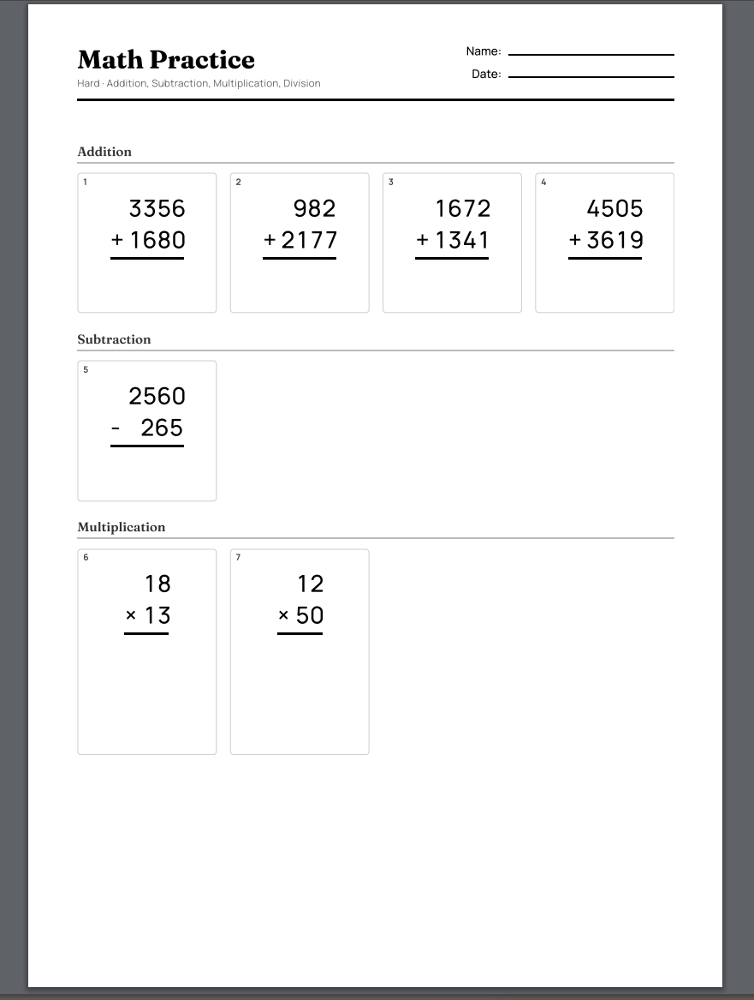

# Rubio

Math practice worksheets for primary school kids. Generate exercises, solve them on screen, or print clean worksheets for pencil-and-paper practice.

**Try it live:** https://juacker.github.io/rubio/



## What it does

- Generates random **addition, subtraction, multiplication, and division** exercises
- Three difficulty levels: **Easy** (early primary), **Medium** (mid primary), and **Hard** (upper primary)
- Instant answer checking with score
- **Print-ready worksheets** with a name/date header, numbered problems, and proper written layouts (stacked operations, Spanish-style "caja" for division)

## How to use

1. Pick the operations you want to practice
2. Choose a difficulty level
3. Set how many exercises (up to 30)
4. Click **Generate Exercises**
5. Solve on screen and click **Check Answers**, or click **Print Worksheet** for a paper copy



## Printing tips

- The printed worksheet hides all screen controls and shows problems in a clean grid layout
- Multiplication with multi-digit numbers includes space for partial products
- Division boxes scale with the size of the numbers so kids have room to work
- There's a name and date field at the top for the student to fill in

## Running locally

You need [Node.js](https://nodejs.org/) installed.

```bash
npm install
npm run dev
```

Then open the URL shown in your terminal (usually `http://localhost:5173`).

## License

This project is provided for educational use.
